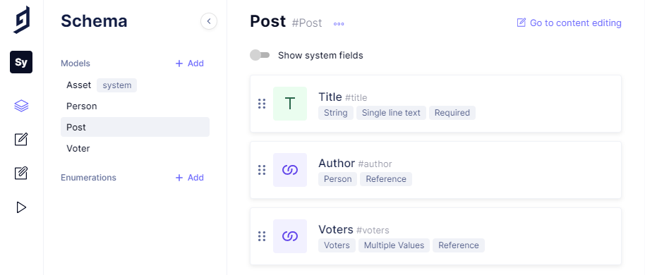
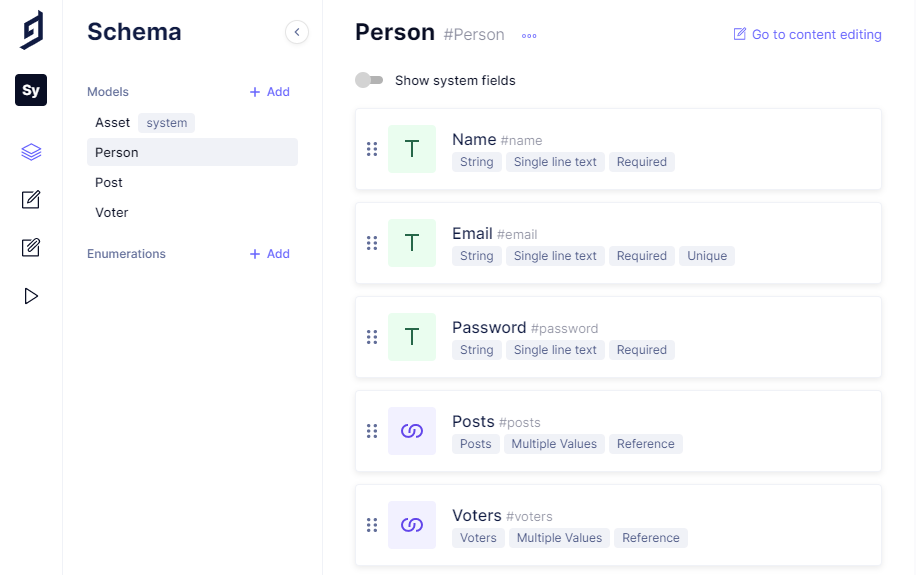
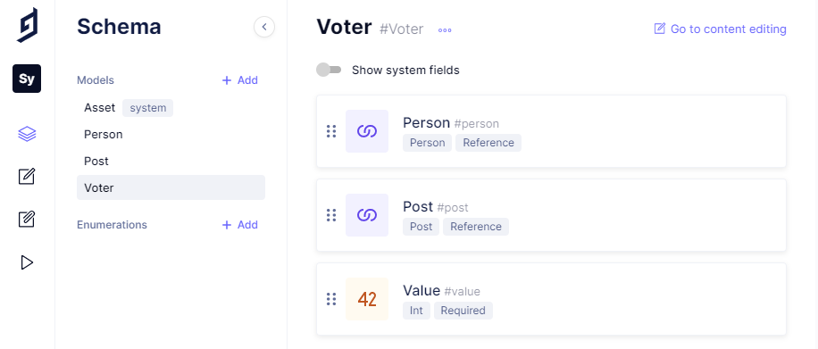
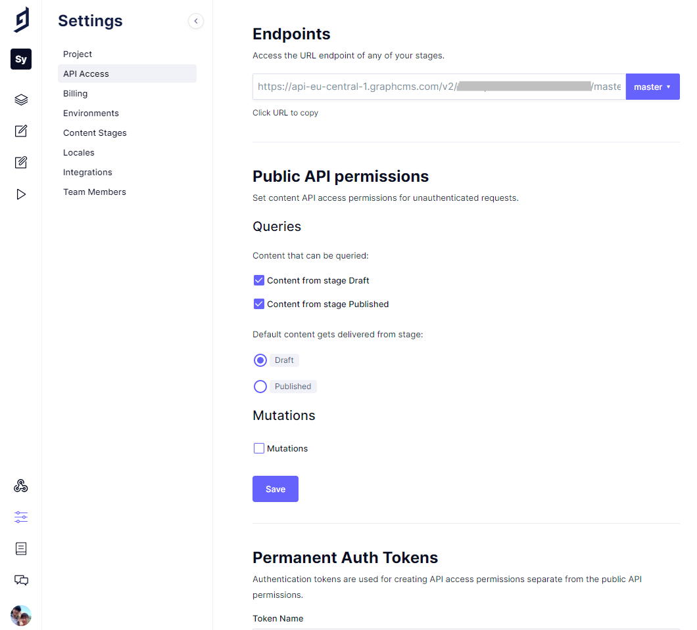

# BACKEND
1. [WHY do we use Graphcms?](#why-do-we-use-graphcms)
2. [Setup](#setup)
3. [Run](#run)
4. [Supported queries and mutations](#supported-mutations-and-queries)
5. [Contribute](#contribution)

<hr/>

## WHY do we use Graphcms?

#### :fast_forward: Easy to setup Database
Headless CMS like "graphcms.com" provides a fully functional set up in just a few steps with graphql native.:ok_hand:

#### :baby: Easy to use
Graphcms provides a lot of tutorials at "https://graphcms.com/docs" to get started. Code examples for specific use cases are also available under "https://graphcms.com/docs/develop/code-examples".

#### :people_holding_hands: Teamwork is more efficient 
Because the server is always online, all team members can easily update and synchronize the data, keeping the database up to date.

#### :muscle: Create Schema easily with Powerful Editors
Graphcms supports a variety of utilities to quickly and explicitly create a schema.  In particular, the GUI allows to simple drag and drop the models.

#### :handshake: Support creating Mutation and Query
When creating a Model in Schema, Graphcms automatically provides basic CRUD functionality throught an API. This saves us a lot of time and boiler plate code. In addition, Graphcms has an interface called "API Playground" to interact with the scheme live or compose complex GraphQL queries.

#### :lock: Security
Setting up access security, team settings, roles and permissions on Graphcms is also extremely simple.

<hr/>

## Setup 

1. Sign up at [GraphCMS](https://graphcms.com/) and create a project there.

2. Define a schema with three types `Post`, `Person` and `Voter`.

3. Get your `GRAPH_CMS_ENDPOINT` and optionally create a `GRAPH_CMS_API_TOKEN` in Settings. And save in `.env`.

4. Store also a JWT secret in `.env`.

## Screenshots

Type `Post`:




Type `Person`:




Type `Voter`:




`GRAPH_CMS_ENDPOINT`:




`GRAPH_CMS_API_TOKEN`:


<hr/>

## Run

Before running tests you need to create a file .env in backend root with the JWT secret, e.g. JWT_SECRET=jsonwebtoken

``` bash
# setup
yarn install

# lint
yarn lint

# run tests
yarn test

# start server at localhost:4000
yarn start

```
<hr/>

## Supported mutations and queries
As soon as you start the server locally, the following mutations are executable (don't require specific permissions):

```
posts(...): [Post!]!,
post(...): Post,
people(...): [Person!]!,
person(...): Person
```

Similarly, these mutations are available:

```
write(post: PostInput!): Post,
login(email: String!,password: String!): String,
upvote(id: ID!): Post,
downvote(id: ID!): Post,
delete(id: ID!): Post,
signup(name: String!,email: String!,password: String!): String
```
Please note, however, that these mutations have rule-based permissions:

- `signup` requires you to enter a password with a minimum of 8 characters
- `write,upvote, delete, downvote` are authentication based. They expect `authorization` credentials, which are automatically generated by the `crypto` module. (To retrieve your credentials, either `signup` or `login` and copy paste the created token.)


<hr/>

## Contribution

Wish to contribute?
We communicate over Moodle:

https://moodle.htw-berlin.de/mod/bigbluebuttonbn/view.php?id=774135

Similarly, we have a Telegram group, if you wish to participate, please contact one of us:

Andrej Loparev:
Andrej.Loparev@Student.HTW-Berlin.de

Truong An Nguyen:
Truong.Nguyen@Student.HTW-Berlin.de

Ilona Eisenbraun:
Ilona.Eisenbraun@Student.HTW-Berlin.de
